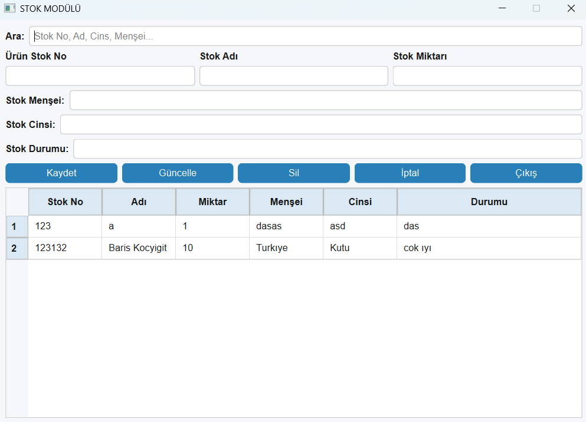

# 📦 Stok Uygulaması

Bu uygulama, PyQt6 ile geliştirilmiş bir masaüstü stok takip sistemidir. Kullanıcı, ürün bilgilerini kaydedebilir, listeleyebilir ve silebilir.

## 🖼️ Ekran Görüntüsü

## ⚙️ Özellikler

- Stok No, Adı, Miktar, Menşei, Cinsi, Durumu bilgileri
- Kayıt ekleme, silme, güncelleme, filtreleme
- MySQL veritabanı entegrasyonu
- PyQt6 arayüzü ile kullanıcı dostu tasarım

## 👨‍💻 Geliştirici

Barış Koçyiğit
